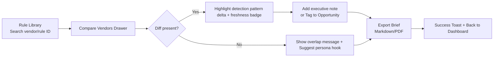

# WAF Security UX Design Specification

_Initialized 2025-11-30 - document will be populated as the UX workflow progresses._

---

## Project & Users (project_and_users_confirmed)
- **Core Experience & Platform (core_experience_and_platform):**
  - **Core Loop:** Upload/ingest domains → automatically fingerprint WAF/CDN → read GTM Radar scores & persona prompts → deep-dive into Rule Transparency cards → export executive/AE-ready briefs.
  - **Platform Focus:** Modern web application (desktop-first) delivered via Streamlit/FastAPI today, but designed so we can port into a React/Next front end later. Responsive behavior needed for tablet viewing; mobile is informational only (no heavy editing).

## Desired Emotional Response (desired_emotional_response)

- **Primary Feelings:** _Calm confidence_ (CISOs feel the data is credible), _Momentum_ (AEs sense the next best story instantly), and _Shared clarity_ (cross-functional teams see the same truth).
- **North Star:** “I know exactly what to say and show next” — the UI should feel like a trusted analyst walking alongside the user, never noisy or chaotic.

## Inspiration Analysis (inspiration_analysis)

| Reference Product | UX Cues to Borrow | Notes |
| --- | --- | --- |
| **Datadog Cloud Security** | Dense-yet-readable tables, stacked cards for telemetry, pill filters that summarize drift. | Their control-plane layout shows how to keep power users in flow while surfacing warnings inline. |
| **Linear.app** | Keyboard-friendly command palette, understated typography, dopamine-light color usage. | Demonstrates how to keep a premium feel with minimal chrome and responsive spacing. |
| **Notion AI Insights** | Narrative blocks with inline callouts, collapsible sections for deep dives. | Mirrors our need to turn telemetry into copy-ready stories without dumping raw data everywhere. |

## Project Vision (project_vision)

WAF Security must feel like a neutral “insight spine” that makes cross-vendor WAF/CDN intelligence obvious and reusable. Every screen should reinforce three outcomes: _see the posture_, _understand the gap_, _tell the story_. Design decisions should highlight how GTM Radar, Rule Transparency Studio, and executive reporting interlock, so a user never wonders what to do next.

## Design System Decision (design_system_decision)

- **Options Reviewed:** Material UI (enterprise reach, opinionated), Ant Design (very dense tables, but heavy), shadcn/ui (Tailwind primitives w/ Radix, themable), Streamlit native (limited customization).
- **Decision:** Adopt **shadcn/ui (Radix-based)** tokens + component patterns, layered over our Streamlit prototype. This gives us accessible headless primitives, consistent spacing, and future-proofs a migration to React/Next without rewriting the UX spec.
- **Customization Plan:** Build bespoke “Persona Prompt Card” and “Rule Comparison Drawer” on top of Radix primitives; align typography + color tokens with the chosen theme. Streamlit styling will follow the same token vocabulary so visuals match even before a full frontend rewrite.

## Defining Experience (defining_experience)

> “Upload a domain, instantly see its WAF/CDN posture, and copy a persona-ready story that you trust.”

The defining interaction is the **Radar-to-Story handoff**: a user selects a domain, watches drift/downtime/attack scores animate into view, and a tailored narrative appears with one click. Everything else (rule comparisons, exports) supports that moment of clarity.

## Core Experience Principles (core_experience_principles)
- **Visual Foundation (visual_foundation):**
  - **Chosen Theme:** _Midnight Intelligence_ (Theme #1 in `docs/ux-color-themes.html`) — deep navy background (#10131B), electric primary (#2D7BFF), aqua accent (#0BD3D3), with semantic greens/yellows/reds for status.
  - **Typography:** Inter (headings + body) with an 8px type scale (48 / 32 / 24 / 20 / 16 / 14 / 12). Use Space Grotesk for hero numerals if/when we move beyond Streamlit.
  - **Spacing:** 8px base grid (Streamlit + shadcn both align). Content cards use 24px padding desktop, 16px tablet, 12px mobile.
  - **Layout Grid:** Desktop 12-column (max width 1440px), Tablet 8-column (max 992px), Mobile 4-column (max 600px). Responsive collapse rules defined later.
  - **Reference HTML:** Full palette visualization & component swatches live in `docs/ux-color-themes.html`.

## Design Direction Decision (design_direction_decision)
- **User Journey Flows (user_journey_flows):**

### Journey A – Run GTM Radar on a Domain

```mermaid
flowchart LR
    A[Domains Table<br/>Select domain] --> B{Enriched already?}
    B -- No --> C[Trigger Enrichment CLI/API]
    C --> D[Progress Toast + Skeleton State]
    B -- Yes --> E[Scores Panel Animates In]
    D --> E
    E --> F[Persona Drawer Opens]
    F --> G[Copy Story Prompt]
    G --> H[Log Usage + Offer Next Action<br/>(Export Brief or Compare Rules)]
```

### Journey B – Build Rule Transparency Story
## Component Library Strategy (component_library_strategy)
- **UX Pattern Decisions (ux_pattern_decisions):**
  - **Button Hierarchy:** Primary (solid #2D7BFF), Secondary (outline, translucent background), Destructive (solid #F75764), Tertiary (text button).
  - **Feedback:** Success/info toasts slide from top-right, auto-dismiss after 4s with action undo; errors stay until acknowledged. Inline validation beneath fields.
  - **Forms:** Labels sit above inputs, required fields use “(required)” text (no lone asterisks). Validation on blur + on submit. Helper text below input in muted color.
  - **Modals/Drawers:** Center modals for confirmations, right-side drawer for contextual info; ESC + outside click close unless destructive confirmation (requires explicit action). Focus trapped; first actionable control auto-focused.
  - **Navigation:** Sidebar shows section + workspace; active item uses aqua indicator bar. Browser back mirrors app breadcrumbs; we persist filters in URL params.
  - **Empty States:** Provide short benefit statement + CTA (“Run Radar on your first domain”) plus optional quick-start links.
  - **Confirmations:** Delete = modal with typed confirmation only for destructive items; unsaved changes prompt when navigating away from editors; exports show success toast with “View Report” link.
  - **Notifications:** Toast stack max 3; additional items queue. Critical alerts pin to top banner with dismiss button.
  - **Search:** Instant filtering as user types (debounced 250ms). Advanced filters open inline panel with chips for WAF vendor, drift buckets, persona.
  - **Dates/Times:** Use relative time (“Updated 2d ago”) with tooltip showing absolute UTC timestamp.

## Responsive & Accessibility Strategy (responsive_accessibility_strategy)

- **Breakpoints & Layout:**
  - **Desktop ≥1280px:** Sidebar pinned, dual-column radar layout, Rule Drawer visible.
  - **Tablet 768–1279px:** Sidebar collapses to icon rail, cards reflow to single column, Rule Drawer becomes modal.
  - **Mobile ≤767px:** Read-only mode—domain list + persona summaries only; editing/export actions hidden behind “Open on desktop” banner.
  - Tables degrade into stacked cards on tablet/mobile; filters collapse into accordion.
- **Accessibility Target:** WCAG 2.1 Level AA.
  - Contrast ratio ≥4.5:1 for text, 3:1 for large UI elements.
  - All interactive controls keyboard reachable; focus states use aqua outline + subtle glow.
  - Screen reader labels include domain, drift score, freshness (“example.com drift 0.82 high”).
  - Toasts, drawers, and modals announce via ARIA live regions; ESC + keyboard shortcuts supported.
  - Tooling plan: automated checks via axe-core + manual keyboard + NVDA/VoiceOver sweeps each release.

---

## Completion Summary (completion_summary)

- **Design System:** shadcn/ui + Radix primitives with 3 custom components (Persona Prompt Card, Rule Comparison Drawer, Insight Queue Timeline).
- **Visual Deliverables:** `docs/ux-color-themes.html` (theme explorer), `docs/ux-design-directions.html` (layout mockups).
- **Design Direction:** Hybrid of Two-Panel Command Center + Guided Playbook for power + focus modes.
- **Journeys:** Radar execution + Rule Transparency storytelling mapped with Mermaid flows.
- **Patterns:** 10+ UX consistency rules documented to keep behaviours predictable.
- **Responsive/Accessibility:** Desktop-first grid with tablet/mobile adaptations; WCAG 2.1 AA commitment plus testing plan.
- **Next Steps:** Move into architecture workflow with this UX spec as reference, or generate high-fidelity Figma mocks using the documented tokens.

- **Radix/shadcn Components Reused:** button, badge, dropdown-menu, table, tabs, dialog, toast, skeleton, tooltip, accordion.
- **Custom Components (need bespoke design specs):**
  1. **Persona Prompt Card**
     - Purpose: show scores + narrative + CTA.
     - Anatomy: header (persona avatar + title), score chips, narrative block, copy button.
     - States: default, copied (checkmark + color pulse), disabled (stale data).
     - Variants: persona types (AE, CISO, Platform) change accent color/icon.
  2. **Rule Comparison Drawer**
     - Purpose: side-by-side vendor rule diff + freshness + CTA.
     - States: default, loading (skeleton), stale (warning bar), exported (badge).
     - Behavior: slide-over panel with tabs (Diff, Notes, Export). Esc closes; focus trapped.
  3. **Insight Queue Timeline**
     - Purpose: track generated stories, annotations, and exports.
     - States: upcoming, active, completed. Includes avatars, timestamps, status badges.
     - Accessibility: list role with ARIA labels for status.
- **Customization Requirements:** tables require sticky headers and inline quick filters; toasts need colored sidebars for semantic associations; Streamlit components to be themed via custom CSS (className hooks + `st.markdown`).



- **Explored Directions:** See `docs/ux-design-directions.html` for the four mockups (Two-Panel Command Center, Storytelling Canvas, Analyst Grid, Guided Playbook).
- **Final Blend:** _Direction #1 (Two-Panel Command Center)_ for default desktop + _Direction #4 (Guided Playbook)_ as a focus mode. This keeps power users productive while giving GTM newcomers a guided narrative workflow.
- **Layout Calls:**
  - Navigation: left sidebar with workspace switcher + primary sections (Radar, Rule Studio, Reports, Workspaces).
  - Content: dual column where the left 2/3 shows Radar table & persona cards, right 1/3 houses Rule Transparency drawer / exports.
  - Density: medium; enough cards visible without overwhelming (max 9 domains per viewport).
- **Interaction Calls:** Primary actions pinned in top header (“Run Radar”, “Generate Brief”), inline persona chips for keyboard nav, right drawer with tabs for “Rule Diff / Notes / Export”.

- **Speed:** Data should feel real-time even when sourced offline—use skeleton loaders < 600ms, animate score changes, and keep high-value actions within one click of the domain list.
- **Guidance:** Provide gentle guardrails (empty-state checklists, inline tips) rather than wizards; users are experts, but new GTM teammates need cues about what to do next.
- **Flexibility:** Support both “focus mode” (single domain deep dive) and “command center” (multi-domain grid) without making users reconfigure the layout each time.
- **Feedback:** Celebrate insight moments with subtle color pulses (greens for validated stories, oranges for stale rules) and include explicit freshness stamps so trust is reinforced visually.

- **Project Snapshot:** Internal “insight spine” that merges WAFtotal (vendor-agnostic managed-rule transparency) with GTM Radar (domain fingerprinting + persona storytelling) so security, architecture, and GTM teams can act with evidence instead of guesswork. (Source: `docs/product-brief-WAF Security-2025-11-30.md`, `docs/prd.md`)
- **Primary Personas:** AE Alex / RevOps Riley (outbound + pipeline owners), CISO Cassandra, Platform Architect Winston, Security Marketing (Paige) and partner overlays.
- **Key Needs:** Instantly see a domain’s WAF/CDN posture, surface rule drift/freshness issues, translate them into board-ready narratives and GTM hooks, all without touching production stacks.

